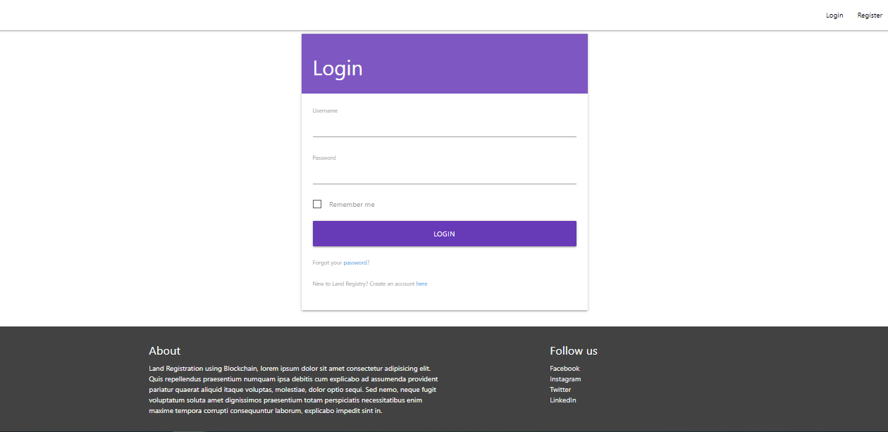
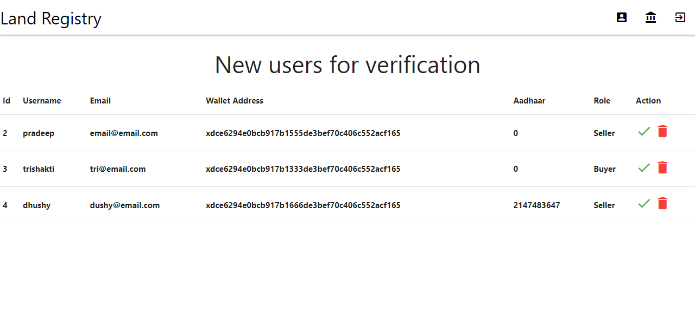
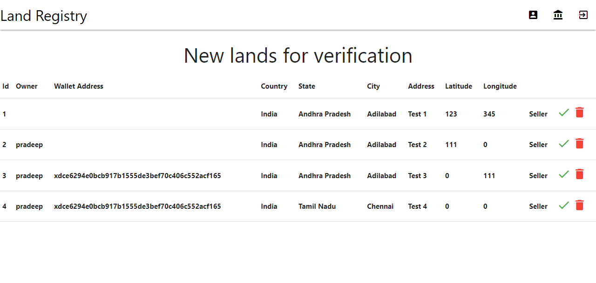
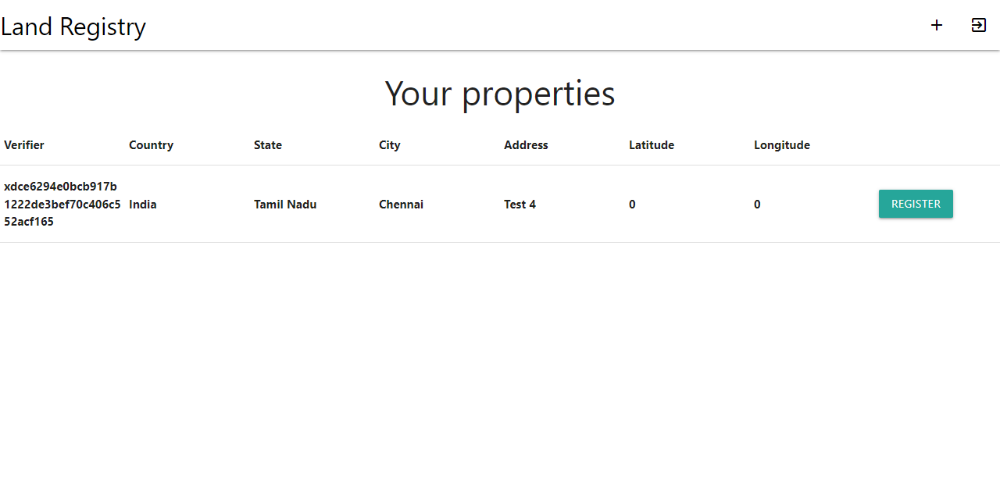
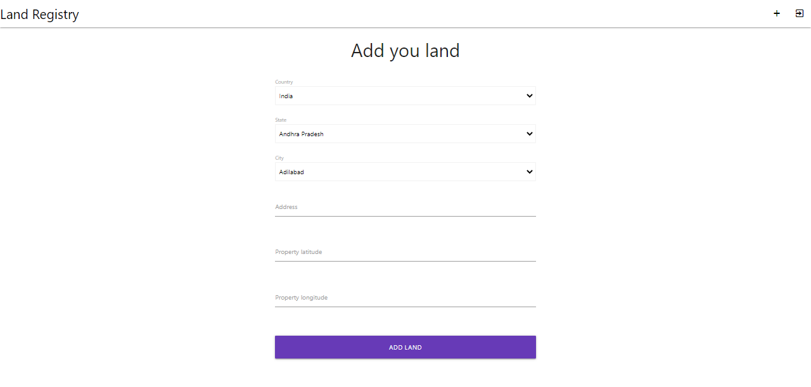
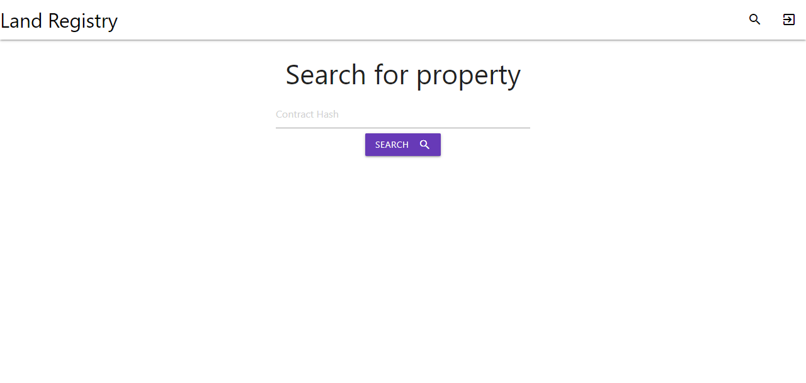

# Land-Registry-on-Blockchain

Property registration and Ownership transfer using Blockchain technology.

[](https://opensource.org/licenses/)
## Authors

- [@tharunbirla](https://www.github.com/tharunbirla)


## Contributing

Contributions are always welcome!

See `contributing.md` for ways to get started.

Please adhere to this project's `code of conduct`.


## Landrecords

The CoViD-19 epidemic caused severe damage to every vital sector, from the private to the public, as well as to human life. People are advised to observe all the necessary regulations to safeguard themselves from the looming pandemic rather than leaving their houses unless absolutely necessary. In this situation, suppose

If property needs to be purchased, residents will need to walk a risky distance to the registration office to complete all the necessary manual procedures to get ownership. In the proposed system for land registration, all processes—from purchasing to selling—take place through the blockchain environment using the participants' own smart devices, eliminating the need for movement.

## Challenges

Increasing the number of land-related lawsuits, tracking several sales of the same piece of land or landed property, the lack of a unique record or "golden record" of ownership, a lack of mechanism to help people verify the land records, the amount of paperwork required to acquire a loan from a bank using land as collateral security, and the financial institutions do not get the factual picture of the piece of land to provide loans.

The farmer must invest time and money to gather all the paperwork, such as a RoR, a mutation extract, a crop certificate, etc., required to obtain a loan, a subsidy, or any other government advantage.

As each of these departments completely depends on the integrity of the other to begin transactions, it is necessary to guarantee that the data in the land records system, registration system, etc. are impervious to tampering. As a result, trust is required to complete approvals for various operations using a shared source of data in order to prevent the issue.

History demonstrates that modified original papers are used to create duplicate registration documents, which are then used to sell properties. Additionally, a single property is sold to several buyers while keeping each of them under the dark.

## Proposed System

The Bockchain has been implemented in this system to speed up the execution of land registration and ownership transfer.
By using smart contracts, certain events may be made to automatically request changes in land records, such as when a property is registered, and they can alter rights and obligations when a bank approves a loan.
The procedure is carried out in the following 5 steps: 

- The first step is for people to sign up for a client-side application.

- The seller must upload land details.

- Step 3: Land inspector validates the land detail.

- Step 4 : Seller signs the smart contract to add the land details in the blockchain.

- Step 5: Buyer checks the contract hash and sends request to seller.

- Step 6: Seller accepts the request and buyer makes paymen.

- New contract is created for land ownership transfer.  

## Benefits

- The availability of data in a central location that can be accessed by all departments

- The land ownership cannot be changed by spurious persons.

- A repository of a transparent, trusted and a tamper proof Property Registration documents would be available for use by citizens & the registration department.

- Before making an offer to purchase a property, citizens can confirm the ownership information and full history of the property.

- Having access to document chains will eliminate registration based on false information.

## Limitations

- As we know that digital signatures aren't accepted in most part of the place. So there is always an uncertainty about the validity of digital signatures.

- Analysis of the technical and security issues has revealed no significant issues at this time. In comparison to other solutions available on the market, we are certain that the technical solution will increase security.

Of course, maintaining and enhancing security and the IT architecture
will continuing, with constant improvements.

## Technology Stack:

+ XDC Network
+ Web3
+ Php 
+ Javascript
+ Jquery
+ MySQL
+ Solidity

## Deployment

To clone this project run

```git
  git clone https://github.com/tharunbirla/Land-Registry-on-Blockchain
```
### Add XinPay in Chrome
You would need to download [XinPay](https://chrome.google.com/webstore/detail/xinfin-ewallet/bocpokimicclpaiekenaeelehdjllofo)

Create your wallet account and select Xinfin Apothem Network

Get test tokens from [Faucet](http://apothem.network/#getTestXDC)

### Setup the Environment
Visit to [Xinfin Remix IDE](remix.xinfin.network)
Upload the files and folders inside `./contract` into the workspace

### Deploy the contract
Copy the from address in [Xinfin Remix IDE](remix.xinfin.network), you can find that under deploy tab

Paste the `address` in `./assets/js/land_contact.js`

## Deploy the application
Deploy the php code to a Apache HTTP server

## Setup Database
Import `./database/langregistry.sql` in MySQL workstation

## Data Flow Diagram


## Screenshots
- Home page

- Login page

- Register page

- Admin user verification page

- Admin land verification page

- Seller's homepage

- Seller's add land page

- Seller sigining smart contract

- Buyer search land page
